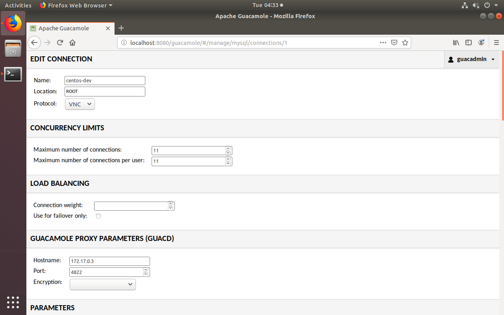

# IoTrain-Lab: IoT Training Platform Using the FIT/IoT-LAB Testbed

IoTrain-Lab is an open-source platform for IoT training that makes use
of the [FIT/IoT-LAB](https://www.iot-lab.info/) testbed for conducting
hands-on exercises. The platform is easy to maintain, migrate and
expand, and provides support for multiple simultaneous users. The
included training content focuses on fundamental IoT training, but IoT
security training content is also included.

An overview of the architecture of IoTrain-Lab is provided in the
figure below. Apache Guacamole manages a set of CentOS Linux
containers on top of Docker that are used by trainees to access the
FIT/IoT-LAB testbed.
<div align=center></div>


## Setup

The following steps are necessary in order to set up IoTrain-Lab. We
assume Ubuntu 18.04 LTS as the host OS, but other operating systems
can be used as well with minor modifications of the setup script.

1. **Change default password:** For security reasons, you should
change the default username and password for the Guacamole PostgreSQL
database by editing the file `.env` located in the directory
`docker-guacamole`.

2. **Run the setup script:** The setup script can be used to
automatically install the Docker-related packages, as well as to build
and start the CentOS, Guacamole and Moodle containers used by
IoTrain-Lab:
	```
	$ ./setup.sh
	```

### Notes

* The installation script only starts one CentOS container, but you
  must start more such containers if you want to support multiple
  trainees simultaneously.
* All the container directories in the IoTrain-Lab distribution
  contain `README.md` files with additional information about those
  containers. Please refer to them for details. Our README file for
  the Moodle container is named `README_moodle.md` and is located in
  the top IoTrain-Lab directory.
* The Moodle container also uses a PostgreSQL database, and for
  security reasons you should also change that username and password
  by editing the file `.env` located in the newly-created directory
  `docker-compose-moodle`, then rebuilding the container.

### FIT/IoT-LAB account

Since IoTrain-Lab uses the FIT/IoT-LAB testbed for the included
hands-on exercises, every user of the platform needs to create an
account on the testbed and configure SSH access, as explained next:
* Use the link on the [FIT/IoT-LAB login
  page](https://www.iot-lab.info/testbed/login?next=%2Fdashboard) to
  register new accounts
* Follow the [tutorial on SSH
  access](https://www.iot-lab.info/tutorials/ssh-access/) to configure
  the CentOS container for FIT/IoT-LAB


## Quick Start

1. **Start all the containers:** Run the command below to start the
IoTrain-Lab containers (this is not needed if you have just run the
`setup.sh` script, in which case the containers are already running):
	```
	$ docker start $(docker ps -a -q)
	```

2. **Configure the Guacamole service:** Follow the steps below to set
up the Guacamole service:

	1. Access the Guacamole home page from a web browser by using
	the address `localhost:8080/guacamole/`; the default username
	and password are both `guacadmin`, but for security reasons
	the password should be changed after the first login

	2. Click on the button at the top right side of the window,
	`Settings > Connections > New connection`

	3. Configure the settings as shown below (click to enlarge the
	figures)
		<div align=center>
		
		
		</div>

		In order to get the IP addresses of the CentOS and
		Guacamole containers, use the command `docker exec -ti
		<CONTAINER_ID> bash` to access the container shell,
		then the commands `ifconfig` for CentOS and `ipaddr`
		for Guacamole to check the IP address.

3. **Begin the training:** Follow the instructions for each training
activity available in the directory `database/` (the "Training
Content" section below provides direct links in the recommended order
for carrying out the activities). Alternatively, each activity
`README.md` file can be uploaded into the Moodle container, which then
serves as an interface for accessing the content.


## Training Content

An overview of the hands-on exercises currently available in
IoTrain-Lab is shown below. If you need more background on IoT
technologies, we suggest using the companion system that we also
developed, [IoTrain-Sim](https://github.com/crond-jaist/iotrain-sim),
which includes tutorials and hands-on exercises conducted via
simulation.
<div align=center></div>

### Exercise overview

Next we introduce each of the exercises in IoTrain-Lab, which are
presented here in the recommended order for performing them based on
topic and difficulty level. Click on each exercise name to view the
corresponding instructions. Before proceeding, we suggest that you
first get familiar with the basic aspects of FIT/IoT-LAB by checking
the [Getting
started](https://www.iot-lab.info/docs/getting-started/introduction/)
page of the testbed documentation web site.

1. [Node Control](database/fundamental_training/devices/node_control/README.md):
	Control a node and get its sensor data, such as temperature and luminosity
	- _Difficulty:_ Easy
2. [Consumption Monitoring](database/fundamental_training/devices/consumption_monitoring/README.md):
	Monitor the power consumption of an IoT device
	- _Difficulty:_ Easy
3. [Ping Testing](database/fundamental_training/protocols/ping_testing/README.md):
	Test the connectivity between two nodes via ping request/reply exchanges
	- _Difficulty:_ Easy
4. [Radio Monitoring](database/fundamental_training/devices/radio_monitoring/README.md):
	Monitor the radio activity of two nodes communicating with each other
	- _Difficulty:_ Medium
5. [Radio Sniffing](database/fundamental_training/devices/radio_sniffing/README.md):
	Capture radio frames and analyze radio communication using Wireshark
	- _Difficulty:_ Medium
6. [RPL Routing](database/fundamental_training/protocols/rpl_routing/README.md):
	Practice with the Routing Protocol for Low-Power and Lossy Networks (RPL)
	- _Difficulty:_ Medium
7. [CoAP Protocol](database/fundamental_training/protocols/coap_protocol/README.md):
	Practice with the Constrained Application Protocol (CoAP)
	- _Difficulty:_ High
8. [MQTT Protocol](database/fundamental_training/protocols/mqtt_protocol/README.md):
	Practice with the Message Queuing  Telemetry Transport (MQTT) protocol
	- _Difficulty:_ High
9. [Flooding Attack](database/security_training/resource_attacks/flooding_attack/README.md):
	Experiment with the flooding attack used to increase energy consumption
	- _Difficulty:_ High


## References

For a research background regarding IoTrain-Lab, please refer to the
following document:
* M. Zhao, "Hands-on IoT Security Training Using IoT Testbeds",
  Master's thesis, September 2019. https://hdl.handle.net/10119/16217

For a list of contributors to this project, check the file
CONTRIBUTORS included with the source code.
