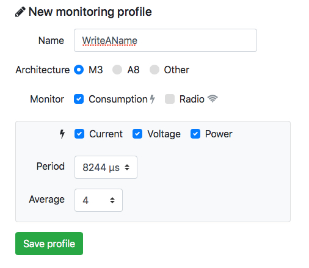
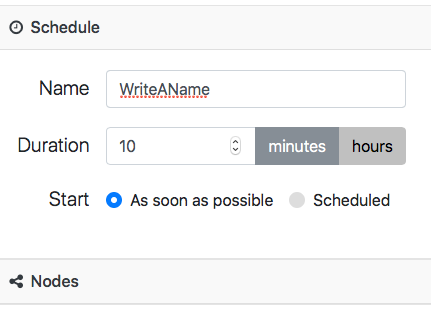
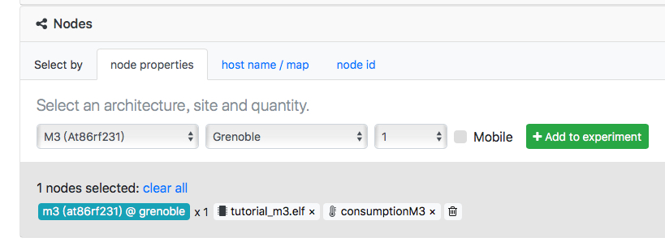
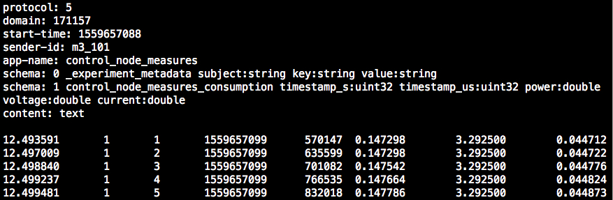
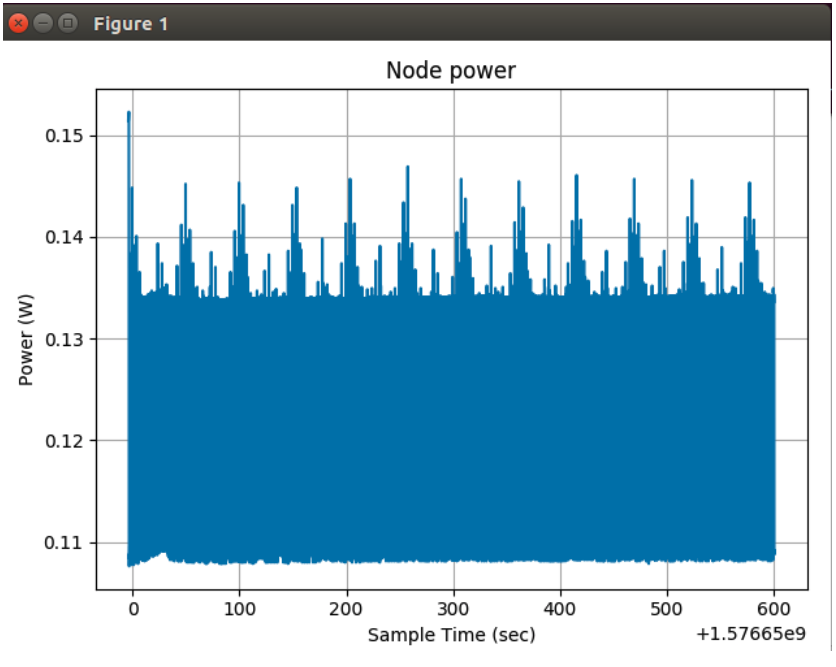

# Consumption Monitoring

* _Classification:_ `Fundamental Training > Devices`
* _Nodes:_ M3 x 1
* _Difficulty:_ Easy


## Overview

Monitoring power consumption is essential for understanding the
specific energy constraints of IoT devices.

In this exercise you will learn how to monitor the power consumption
of an M3 node. The firmware used will turn on/off the device LEDs
periodically, thus causing changes in power consumption.


## Tutorial

1. Log in to the FIT/IoT-LAB [web
portal](https://www.iot-lab.info/testbed/dashboard), as we'll use it
next to configure the experiment.

2. To create a consumption monitoring profile, click on "My
Resources", then select "Monitoring profiles" and choose "New
profile". Configure the settings by referring to the figure below,
then save the profile.
	<div align=center></div>

3. Create a new 10 minute experiment by referring to the figure below.
	<div align=center></div>

4. Select the experiment node architecture, site and quantity, as
shown in the figure below. Then upload as firmware the file
`tutorial_m3.elf` included in the directory of this exercise, which we
created in advance to turn on/off the device LEDs
periodically. Finally, assign to the node the monitoring profile that
we created above.
	<div align=center></div>

	After adding the node to the experiment, click on "Submit
	experiment", then make a note of the experiment ID and node ID
	once they are displayed, as they are needed at steps 6 and 7
	below.

4. Connect to the Grenoble SSH frontend by enabling X11 forwarding, so
that the remote application display is forwarded to your computer:
	```
	your_computer:~$ ssh -X <username>@grenoble.iot-lab.info
	```

5. The consumption data is stored in a file with the extension
`.oml`. Make sure to wait until the experiment finishes and the file
is completely written to disk before checking its content:
	```
	$ username@grenoble:~$ less ~/.iot-lab/<experiment_ID>/consumption/m3_<node_ID>.oml
	```

	The file should look similar to the one shown in the figure
	below.
	<div align=center></div>

6. Plot the consumption data using the appropriate script provided by
FIT/IoT-LAB:
	```
	$ username@grenoble:~$ plot_oml_consum -p -i ~/.iot-lab/<experiment_ID>/consumption/m3_<node_ID>.oml
	```

	You should obtain a graph similar to the one pictured
	below. You can observe power consumption oscillations
	corresponding to the LED blinking intervals. It is also
	possible to measure the current on each LED, which should be
	around 2.4 mA.
	<div align=center></div>

### Notes

* For the commands at steps 6 and 7 above, the correct name of the
  consumption data file is `m3_<node_ID>.oml` (for instance,
  `m3_101.oml`), not `m3-<node_ID>.oml` as one may assume.
* The file `led_sequence.c` included in the directory of this exercise
  provides an example of how the device LEDs could be turned on/off
  periodically, as we did in this tutorial.
