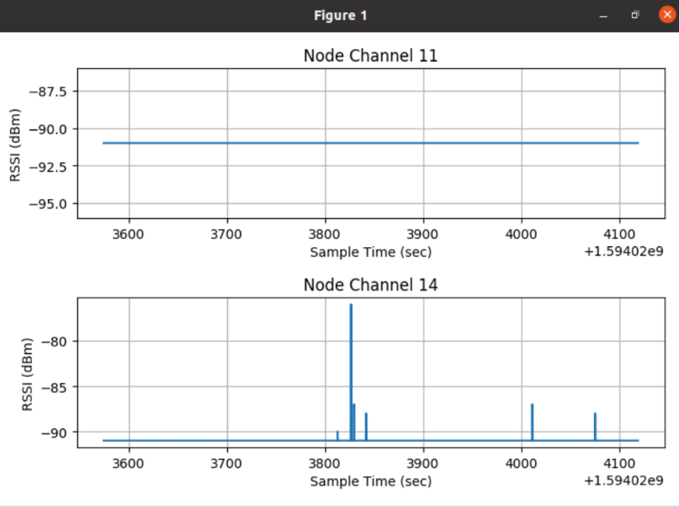

# Radio Monitoring

* _Classification:_ `Fundamental Training > Devices`
* _Nodes:_ M3 x 2
* _Difficulty:_ Medium


## Overview

Monitoring radio activity is useful to understand in more detail the
wireless communication between IoT devices, and important performance
metrics related to it, such as RSSI (Received Signal Strength
Indicator).

In this exercise you will learn how to monitor radio activity during
an experiment in which two M3 nodes communicate with each other.


## Tutorial

1. Connect to the SSH frontend of the Grenoble site of FIT/IoT-LAB by
using the `username` you created when you registered with the testbed:
	```
	your_computer:~$ ssh <username>@grenoble.iot-lab.info
	```

2. Confirm the wireless communication settings in the source code:
	```
	username@grenoble:~$ less ~/iot-lab/parts/openlab/appli/iotlab_examples/tutorial/main.c
	```

	Look for lines similar to the ones below to determine the
	channel number and power transmission settings. If you want to
	change the channel, make sure to chose a number between 11 and
	26; we used 14 to prevent interference with nodes using the
	default setting, which is 11:
	```
	#define CHANNEL 14
	#define RADIO_POWER PHY_POWER_0dBm
	```

3. Compile the tutorial firmware that we'll use in this exercise:
	```
	username@grenoble:~$ cd ~/iot-lab/parts/openlab/build.m3
	username@grenoble:~/iot-lab/parts/openlab/build.m3$ make tutorial_m3
	```

4. Copy the compiled firmware to your computer for use at step 6:
	```
	your_computer:~$ scp username@grenoble.iot-lab.info:~/iot-lab/parts/openlab/build.m3/bin/tutorial_m3.elf .
	```

5. Log in to the FIT/IoT-LAB [web
portal](https://www.iot-lab.info/testbed/dashboard) and create a radio
monitoring profile for M3 nodes. For that, click on "My Resources",
select "Monitoring profiles" and choose "New profile", then configure
the settings as indicated below (see also the note at the end of this
document):
	- Architecture: M3
	- Monitor: Radio
		* [x] rssi
		* Channels: 11, 14
		* Period: 1
		* Measures: 1 per channel

6. Create a new experiment with the following properties:
	- Duration: 10 minutes
	- Start: As soon as possible

7. Configure the experiment node properties as shown below:
	- Architecture: M3
	- Site: Grenoble
	- Quantity: 2

	Update the node firmware using the file `tutorial_m3.elf` you
	copied at step 3, and assign the monitoring profile that we
	created at before. After clicking on "Submit experiment", make
	a note of the experiment and node IDs once they are displayed,
	as they are needed later.

8. Connect to the first node and confirm the displayed command menu:
	```
	username@grenoble:~$ nc m3-<node_ID1> 20000

	IoT-LAB Simple Demo program
	Type command
		h:	print this help
		t:	temperature measure
		l:	luminosity measure
		p:	pressure measure
		u:	print node uid
		d:	read current date using control_node
		s:	send a radio packet
		b:	send a big radio packet
		e:	toggle leds blinking

	Type Enter to stop printing this help

	cmd >
	```

9. Use a new terminal window to connect to the second node (the same
command menu as above will be displayed):
	```
	your_computer:~$ ssh username@grenoble.iot-lab.info
	username@grenoble:~$ nc m3-<node_ID2> 20000
	```

10. Send some radio packets from the first to the second node using
the terminal window from step 8:
	```
	cmd > b
	cmd >
	radio > Big packet sent
	cmd > b
	cmd >
	radio > Big packet sent
	cmd > b
	cmd >
	radio > Big packet sent
	```

11. Check that the packets were received by the second node using the
terminal window from step 9:
	```
	cmd >
	radio > Got packet from c05e. Len: 16 Rssi: -66: 'Hello World!:  4 012345678901234567890123456789012345678'
	cmd >
	radio > Got packet from c05e. Len: 16 Rssi: -66: 'Hello World!:  4 012345678901234567890123456789012345678'
	cmd >
	radio > Got packet from c05e. Len: 16 Rssi: -66: 'Hello World!:  4 012345678901234567890123456789012345678'
	```

12. Open an third terminal and connect to the Grenoble SSH frontend by
enabling X11 forwarding, so that the remote application display is
forwarded to your computer:
	```
	your_computer:~$ ssh -X <username>@grenoble.iot-lab.info
	```

13. Confirm the measured RSSI values for the receiving (second) node
that are stored in a file with the extension `.oml`:
	```
	username@grenoble:~$ less ~/.iot-lab/<experiment_ID>/radio/m3_<node_ID2>.oml
	```

	The file will contain data similar to that shown below:
	```
	protocol: 4
	domain: 4291
	start-time: 1397726665
	sender-id: m3-3
	app-name: control_node_measures
	schema: 0 _experiment_metadata subject:string key:string value:string
	schema: 2 control_node_measures_radio timestamp_s:uint32 timestamp_us:uint32 channel:uint32 rssi:int32
	content: text

	0.620337	2	1	1397726665	577557	11	-91
	0.620611	2	2	1397726665	578533	14	-91
	0.620642	2	3	1397726665	579510	11	-91
	0.620672	2	4	1397726665	580486	14	-91
	...
	```

	The explanation about RSSI from the FIT/IoT-LAB documentation
	is provided below for your reference:
	> RSSI stands for Received Signal Strength Indication. It is
	> the relative received signal strength in a wireless
	> environment.  In IoT-LAB, measured RSSI values provide an
	> indication of the radio power level received by the antenna
	> of the control-node, embedded into and driven by the
	> gateway. The RSSI value is expressed in dBm
	> (Decibel-milliwatts), and represents the power ratio in
	> decibels (dB) of the measured power referenced to one
	> milliwatt (mW). A power level of 0 dBm corresponds to 1mW.

14. Plot the radio monitoring file for the receiving node:
	```
	username@grenoble:~$ plot_oml_radio -a -i ~/.iot-lab/<experiment_ID>/radio/m3_<node_ID2>.oml
	```

	You should obtain a graph similar to the one shown below. No
	transmissions were observed on channel 11, for which only a
	background noise of about 91 dBm is present, and the three big
	packets that we sent appeared as spikes in the RSSI data on
	channel 14.
	<div align=center></div>

### Note

We provide below more information from the FIT/IoT-LAB documentation
about the radio channel monitoring settings mentioned at step 5:
* "Channels" represents the list of radio channels to monitor. The
  physical layer (PHY) 802.15.4 divides the available bandwidth in
  sixteen channels numbered from 11 to 26. You can share the
  monitoring time to measure RSSI on several channels.
* "Period" is the time duration of each measurement for a channel,
  expressed in ms.
* "Measures" represents the number of time measurements to be done per
  each channel.
