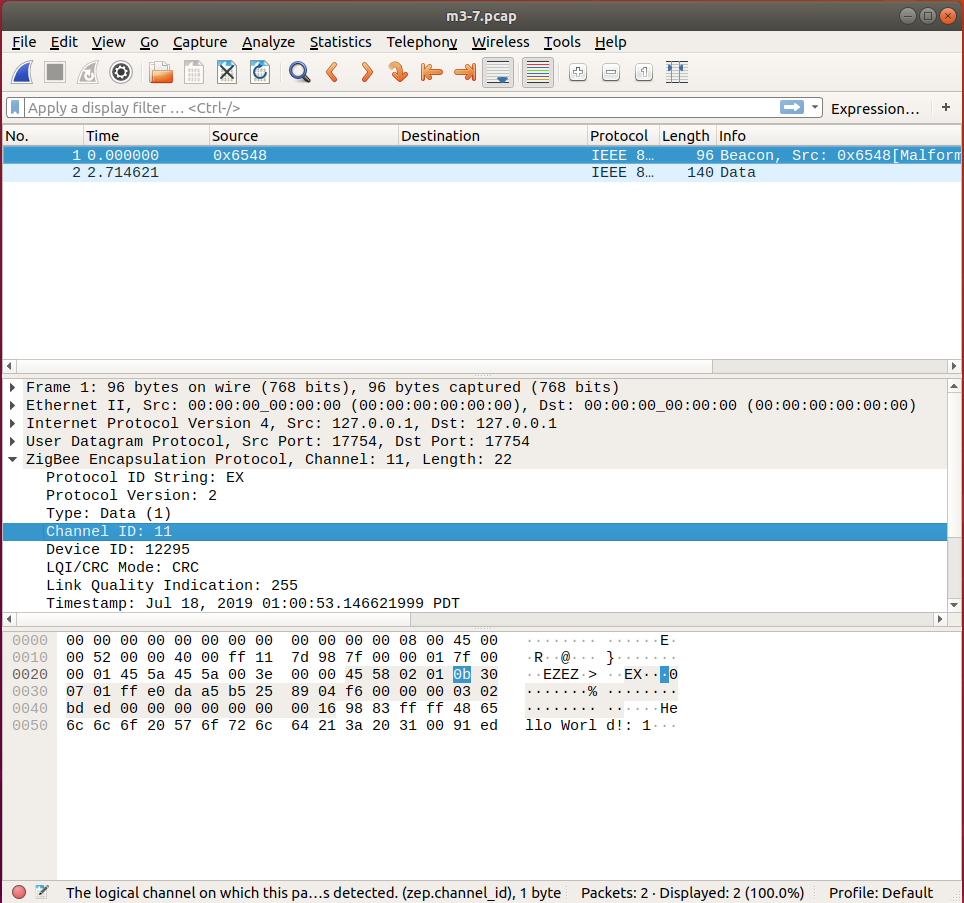

# Radio Sniffing

* _Classification:_ `Fundamental Training > Devices`
* _Nodes:_ M3 x 5
* _Difficulty:_ Medium


## Overview

Capturing radio frames makes it possible to analyze the radio
communication between IoT devices, thus it is an useful technique for
understanding more deeply their behavior.

In this exercise you will learn how to create a profile for capturing
and analyzing radio communication, how to actually capture radio
frames, and how to visualize them using the Wireshark packet analyzer.


## Tutorial

1. Log in to the FIT/IoT-LAB [web
portal](https://www.iot-lab.info/testbed/dashboard) and create a radio
monitoring profile for M3 nodes. For that, click on "My Resources",
select "Monitoring profiles" and choose "New profile", then configure
the settings as indicated below:
	- Architecture: M3
	- Monitor: Radio
		* [x] sniffer
		* Channels: As configured in your firmware (see step 3)

2. Create a new experiment with the following properties:
	- Duration: 10 minutes
	- Start: As soon as possible

3. In this experiment we will use a total of five M3 nodes that must
be in the same radio neighborhood, hence node IDs should be specified
when making the reservation via the "node id" tab:
	- The first group contains the sniffer node:
		* Site: Grenoble
		* Architecture: M3
		* IDs: 7
	- The second group includes the communicating nodes:
		* Site: Grenoble
		* Architecture: M3
		* IDs: 8-11

	For all the nodes you can use the firmware `tutorial_m3.elf`
	compiled in the exercise `Radio Monitoring`. For the sniffer
	node, make sure to use the monitoring profile defined at step
	1. After finishing the settings, click on "Submit experiment"
	to start the experiment.

4. Connect to the SSH frontend of the Grenoble site of FIT/IoT-LAB by
using the `username` you created when you registered with the testbed:
	```
	your_computer:~$ ssh <username>@grenoble.iot-lab.info
	```

5. Use the `serial_aggregator` program available on FIT/IoT-LAB to
interact with the nodes in a centralized fashion:
	```
	username@grenoble:~$ serial_aggregator
	```

	The output will be similar to that shown below:
	```
	1421069467.222714;Aggregator started
	1421069467.380965;m3-7;A
	1421069467.381105;m3-7;
	1421069467.382198;m3-7;IoT-LAB Simple Demo program
	1421069467.382308;m3-7;Type command
	1421069467.390591;m3-7;	h:	print this help
	1421069467.390705;m3-7;	t:	temperature measure
	1421069467.390800;m3-7;	l:	luminosity measure
	1421069467.390889;m3-7;	p:	pressure measure
	1421069467.391089;m3-7;	s:	send a radio packet
	1421069467.391181;m3-7;	b:	send a big radio packet
	1421069467.391376;m3-7;	e:	toggle leds blinking
	1421069467.391474;m3-7;
	1421069467.391560;m3-7; Type Enter to stop printing this help
	```

	You can use the key combination "Space+Enter" to stop the
	program output.

6. Open a second terminal to start the `sniffer_aggregator` program
for the sniffer node (`m3-7` in our example), so that radio packets
are captured into a file:
	```
	your_computer:~$ ssh <username>@grenoble.iot-lab.info
	username@grenoble:~$ sniffer_aggregator -l grenoble,m3,7 -o m3-7.pcap
	```

	The output will be similar to that shown below:
	```
	1421070437.561983;Aggregator started
	```

7. Use the first terminal window to send packets from one node to
another:
	- For the sniffer node (`m3-7` in our example), use the
	  command `m3-7;s` to send a packet to the other nodes
	- For any of the other nodes (for instance, `m3-11`), you can
	  use the command `m3-11;s` to send packets

8. After you have sent enough packets, use the key combination
"Ctrl+C" in the second terminal to close the sniffer aggregator
program, then display the packet capture file:
	```
	username@grenoble:~$ /usr/sbin/tcpdump -v -r m3-7.pcap
	```

	The output will be similar to that shown below:
	```
	reading from file m3-7.pcap, link-type EN10MB (Ethernet)
	10:00:53.146621 IP (tos 0x0, ttl 255, id 0, offset 0, flags [DF], proto UDP (17), length 82)
	localhost.17754 > localhost.17754: UDP, length 54
	10:00:55.861242 IP (tos 0x0, ttl 255, id 0, offset 0, flags [DF], proto UDP (17), length 126)
	localhost.17754 > localhost.17754: UDP, length 98
	...
	```

9. Copy the packet capture file from FIT/IoT-LAB to your computer, and
open it using the Wireshark packet analyzer (see the note below for
instructions in case you haven't yet installed Wireshark):
	```
	your_computer:~$ scp <login>@grenoble.iot-lab.info:m3-7.pcap m3-7.pcap
	your_computer:~$ wireshark m3-7.pcap
	```

	The screenshot below displays the packet sent from the sniffer
	node `m3-7`. Analyze its content considering that the tutorial
	firmware uses a custom MAC layer without 802.15.4 framing. For
	instance, you can confirm the used channel number, which is in
	our case 11. In the bottom panel you can also see the payload
	of the sent packet containing the "Hello World" string.
	<div align=center></div>

### Note

Wireshark is an open-source packet analyzer that can be easily
installed on many operating systems, so please check the program [web
site](https://www.wireshark.org/) for download information and
details. We provide below some terminal installation commands:
* Ubuntu: `sudo apt install wireshark`
* CentOS: `sudo yum install wireshark wireshark-gnome`
