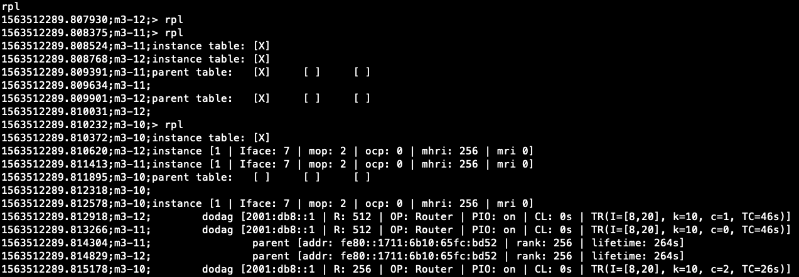

# RPL Routing

* _Classification:_ `Fundamental Training > Protocols`
* _Nodes:_ M3 x 3
* _Difficulty:_ Medium


## Overview

RPL (Routing Protocol for Low-Power and Lossy Networks) is a routing
protocol for wireless networks that have low power consumption and are
susceptible to packet loss. RPL is a proactive protocol based on
distance vectors that operates on top of IEEE 802.15.4 and is
optimized for multi-hop and many-to-one communication, but also
supports one-to-one messaging.

In this exercise you will learn how to use the RPL implementation in
RIOT OS by leveraging the `gnrc_networking` example provided in the
RIOT repository of FIT/IoT-LAB.


## Procedure

1. Connect to the SSH frontend of the Saclay site of FIT/IoT-LAB by
using the `username` you created when you registered with the testbed:
	```
	your_computer:~$ ssh <username>@saclay.iot-lab.info
	```

2. Compile the RIOT firmware for M3 type nodes:
	```
	username@saclay:~$ source /opt/riot.source
	username@saclay:~$ cd iot-lab/parts/RIOT/examples/gnrc_networking/
	username@saclay:~/iot-lab/parts/RIOT/examples/gnrc_networking$ BOARD=iotlab-m3 make all
	```

3. Create and run the experiment via the command line or the web
portal:

	- If using the command line, follow the steps below to start a
	10 minute experiment with 3 nodes of type M3 using the
	firmware you just compiled:
		```
		username@saclay:~/iot-lab/parts/RIOT/examples/gnrc_networking$ cd bin/iotlab-m3/
		username@saclay:~/iot-lab/parts/RIOT/examples/gnrc_networking/bin/iotlab-m3$ iotlab-experiment submit -n RPL -d 10 -l 3,archi=m3:at86rf231+site=saclay,gnrc_networking.elf
		```

		Use the command `iotlab-experiment get -i
		<experiment_ID> -ri` to check which nodes were
		allocated. You can use `iotlab-experiment -h` to learn
		more details about the available parameters for this
		command.

	- If using the web portal, follow the steps below to run the
	same experiment described above:

		* Copy the compiled firmware from FIT/IoT-LAB to your
		computer:
			```
			your_computer:$ scp <username>@saclay.iot-lab.info:iot-lab/parts/RIOT/examples/gnrc_networking/bin/iotlab-m3/gnrc_networking.elf .
			```

		* Log in to the FIT/IoT-LAB [web
		portal](https://www.iot-lab.info/testbed/dashboard) and
		create a new experiment with a 10 minute duration that
		should be started as soon as possible. Use the "node
		properties" tab to reserve the nodes as follows:
			- Architecture: M3
			- Site: Saclay
			- Quantity: 3

		Update the node firmware using the file
		`gnrc_networking.elf` you copied above. After clicking
		on "Submit experiment", make a note of the experiment
		and node IDs once they are displayed, as they are
		needed later.

4. Initialize the RPL protocol for the interface 7 of all the nodes
(`m3-10` to `m3-12` in our example):

	- Start the `serial_aggregator` program:
		```
		username@saclay:~$ serial_aggregator
		```

	- Input `rpl init 7` in the terminal to send the command to
	all the nodes; the output should look as shown below:
		```
		1449177253.320969;m3-11;> rpl init 7
		1449177253.322160;m3-10;> rpl init 7
		1449177253.322816;m3-11;successfully initialized RPL on interface 7
		1449177253.323151;m3-12;> rpl init 7
		1449177253.323429;m3-10;successfully initialized RPL on interface 7
		1449177253.324136;m3-12;successfully initialized RPL on interface 7
		```

5. In this example we choose `m3-10` as the root node of the RPL DAG
topology, and we need to configure a global IPv6 address for it that
can be used as the RPL DODAG-ID (more information about the IPv6
support in FIT/IoT-LAB is available
[here](https://www.iot-lab.info/docs/getting-started/ipv6/)). Follow
the steps below for this purpose:

	- Input the command `m3-10;ifconfig 7 add 2001:db8::1` to add
	a global IPv6 address for node `m3-10`:
		```
		1563512178.479955;m3-10;> ifconfig 7 add 2001:db8::1
		1563512178.481951;m3-10;success: added 2001:db8::1/64 to interface 7
		```

	- Then input the command `m3-10;rpl root 1 2001:db8::1` to set
	the node as the root of the RPL DODAG with the instance id 1
	and the configured IPv6 address as DODAG-ID:
		```
		1563512212.335127;m3-10;> rpl root 1 2001:db8::1
		1563512212.336120;m3-10;successfully added a new RPL DODAG
		```

6. Display details about the RPL state of all the nodes in the
experiment by inputting the command `rpl`. The output should look like
the screenshot below.
	<div align=center></div>

7. As information for all the nodes gets mixed in the above output,
and may be somewhat difficult to understand, it is also possible to
see details for individual nodes, as follows:

	- Input `m3-10;rpl` to show information only about the root
	node `m3-10`:
		```
		1563512273.099829;m3-10;> rpl
		1563512273.100043;m3-10;instance table:	[X]
		1563512273.100785;m3-10;parent table:	[ ]	[ ]	[ ]
		1563512273.100997;m3-10;
		1563512273.101687;m3-10;instance [1 | Iface: 7 | mop: 2 | ocp: 0 | mhri: 256 | mri 0]
		1563512273.104523;m3-10;	dodag [2001:db8::1 | R: 256 | OP: Router | PIO: on | CL: 0s | TR(I=[8,20], k=10, c=2, TC=43s)]
		```

	- Input `m3-11;rpl` to show information only about the child
	node `m3-11`:
		```
		1563512224.996354;m3-11;> rpl
		1563512224.996582;m3-11;instance table:	[X]
		1563512224.996719;m3-11;parent table:	[X]	[ ]	[ ]
		1563512224.996842;m3-11;
		1563512224.997709;m3-11;instance [1 | Iface: 7 | mop: 2 | ocp: 0 | mhri: 256 | mri 0]
		1563512224.999059;m3-11;	dodag [2001:db8::1 | R: 512 | OP: Router | PIO: on | CL: 0s | TR(I=[8,20], k=10, c=2, TC=3s)]
		1563512225.001717;m3-11;		parent [addr: fe80::1711:6b10:65fc:bd52 | rank: 256 | lifetime: 296s]
		```

	- Input `m3-12;rpl` to show information only about the child
	node `m3-12`:
		```
		1563512250.343914;m3-12;> rpl
		1563512250.344897;m3-12;instance table:	[X]
		1563512250.345089;m3-12;parent table:	[X]	[ ]	[ ]
		1563512250.345226;m3-12;
		1563512250.347226;m3-12;instance [1 | Iface: 7 | mop: 2 | ocp: 0 | mhri: 256 | mri 0]
		1563512250.350864;m3-12;	dodag [2001:db8::1 | R: 512 | OP: Router | PIO: on | CL: 0s | TR(I=[8,20], k=10, c=1, TC=15s)]
		1563512250.351083;m3-12;		parent [addr: fe80::1711:6b10:65fc:bd52 | rank: 256 | lifetime: 288s]
		```

	- The output of the above commands shows, for instance, that
	while the root node has no parent field, both the child nodes
	have the root node as parent (IPv6 address
	`fe80::1711:6b10:65fc:bd52`).

### Note

When using the command-line tools of FIT/IoT-LAB, if you don’t want to
specify your credentials (login/password) everytime you launch a
command, you can store your credentials by running the command below
once for each SSH frontend host that you log in to:
```
$ iotlab-auth -u <username>
```
