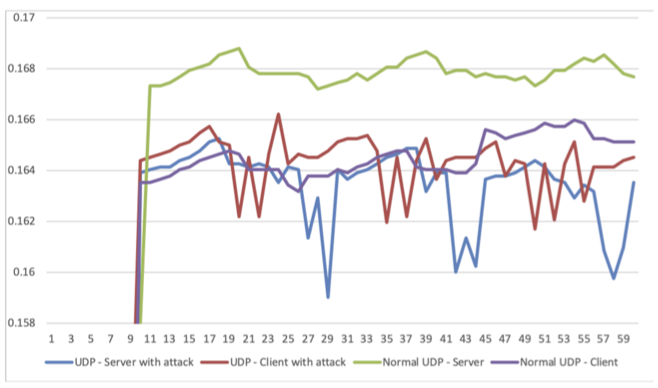

# Flooding Attack

* _Classification:_ `Security Training > Resource Attacks`
* _Nodes:_ M3 x 4
* _Difficulty:_ High


## Overview

The flooding attack in a classical example of an attack on network
resources in which a large number of packets, typically "HELLO"
messages, are transmitted unnecessarily in order to increase energy
consumption.

In this exercise you will learn how to use M3 nodes to conduct an
experiment by which the normal and attack network conditions can be
compared. To implement the attack you will modify the RPL protocol
source code in order to introduce malicious node behavior.


## Tutorial

1. Connect to the SSH frontend of the Grenoble site of FIT/IoT-LAB by
using the `username` you created when you registered with the testbed,
then check the original source code files used in this
exercise,`rpl-timers.c` and `rpl-private.h`:
	```
	your_computer:~$ ssh <username>@grenoble.iot-lab.info
	username@grenoble:~$ cd iot-lab/parts/contiki/core/net/rpl/
	username@grenoble:~/iot-lab/parts/contiki/core/net/rpl$ less rpl-private.h
	username@grenoble:~/iot-lab/parts/contiki/core/net/rpl$ less rpl-private.c
	```

2. Create the reference experiment using existing Contiki source code:

	- Compile the firmware for the example `rpl-udp` that will be
	used as baseline scenario:
		```
		username@grenoble:~$ cd iot-lab/parts/contiki/examples/ipv6/rpl-udp/
		username@grenoble:~/iot-lab/parts/contiki/examples/ipv6/rpl-udp$ make TARGET=iotlab-m3
		```

	- Use the generated firmware files `udp-client.iotlab-m3` and
	`udp-server.iotlab-m3` to submit a 10 minute experiment with
	one UDP server and three UDP clients (the monitoring profile
	`consumptionM3` from the exercise `Consumption Monitoring` is
	also used):
		```
		username@grenoble:~/iot-lab/parts/contiki/examples/ipv6/rpl-udp$ iotlab-experiment submit -n flooding_reference -d 10 -l 3,archi=m3:at86rf231+site=grenoble,udp-client.iotlab-m3,consumptionM3 -l 1,archi=m3:at86rf231+site=grenoble,udp-server.iotlab-m3,consumptionM3
		```

		After getting the experiment ID, use the command
		`iotlab-experiment get -i <experiment_ID> -ri` to
		check the allocated node IDs.

3. Analyze the power consumption data for the reference experiment:

	- The measured power consumption data is stored in a file with
	the extension `.oml`:
		```
		username@grenoble:~$ less ~/.iot-lab/<experiment_ID>/consumption/m3_<node_ID>.oml
		```

	- Plot the power consumption data using the `plot_oml_consum`
	script:
		```
		username@grenoble:~$ plot_oml_consum -p -i ~/.iot-lab/<experiment_ID>/consumption/m3_<node_ID>.oml
		```

4. Modify the source code as needed to implement the flooding attack:

	- For `rpl-private.h`, define several RPL DIS constants to
	force the node to send DIS messages constantly by adding the
	following code in the section called "DIS related":
		```
		#ifdef  RPL_DIS_INTERVAL_CONF
		#define RPL_DIS_INTERVAL                RPL_DIS_INTERVAL_CONF
		#else
		#define RPL_DIS_INTERVAL                0
		#endif
		#define RPL_DIS_START_DELAY             0
		```

		You can refer to `rpl-private-reference.h` and
		`rpl-private-attack.h` in the directory of this
		exercise, which are the original and modified files.

	- For `rpl-timers.c`, introduce a loop to cause the sending of
	multiple RPL DIS messages by adding the following code in the
	function `handle_periodic_timer()`:
		```
		int i=0;
		while (i<20) {i++; dis_output(NULL);}
		```

		You can refer to `rpl-timers-reference.c` and
		`rpl-timers-attack.c` in the directory of this
		exercise, which are the original and modified files.

5. Create the attack experiment that includes the flooding attack
code:

	- Recompile the firmware to include the attack behavior by
	using the files created at step 4:
		```
		username@grenoble:~/iot-lab/parts/contiki/examples/ipv6/rpl-udp$ make TARGET=iotlab-m3
		```

	- Use the new firmware files to submit a new experiment with
	malicious nodes, similarly to the way in which it was done
	above for the reference scenario:  
		```
		username@grenoble:~/iot-lab/parts/contiki/examples/ipv6/rpl-udp$ iotlab-experiment submit -n flooding_attack -d 10 -l 3,archi=m3:at86rf231+site=grenoble,udp-client.iotlab-m3,consumptionM3 -l 1,archi=m3:at86rf231+site=grenoble,udp-server.iotlab-m3,consumptionM3
		```

		After getting the experiment ID, use the command
		`iotlab-experiment get -i <experiment_ID> -ri` to
		check the allocated node IDs.

6. Analyze the power consumption data for the attack experiment:

	- The measured power consumption data is stored in a file with
	the extension `.oml`:
		```
		username@grenoble:~$ less ~/.iot-lab/<experiment_ID>/consumption/m3_<node_ID>.oml
		```

	- Plot the power consumption data using the `plot_oml_consum`
	script:
		```
		username@grenoble:~$ plot_oml_consum -p -i ~/.iot-lab/<experiment_ID>/consumption/m3_<node_ID>.oml
		```

7. To understand the difference between the reference and attack
scenarios, you should compare the data measured in the two cases. The
plots below display the power consumption data for the attack and
reference scenarios represented on the same graph, including both the
UDP server and client. Note the higher variation of the power
consumption for the attack scenario.
<div align=center></div>
